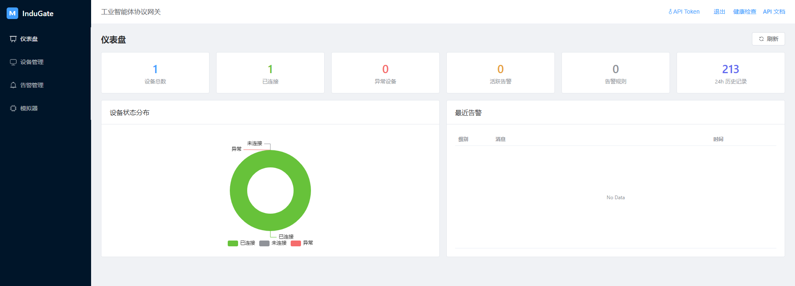
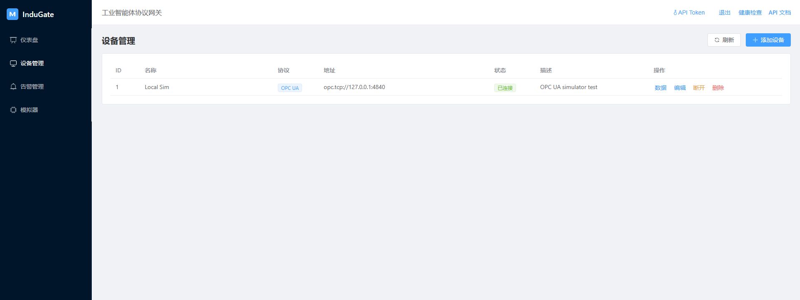
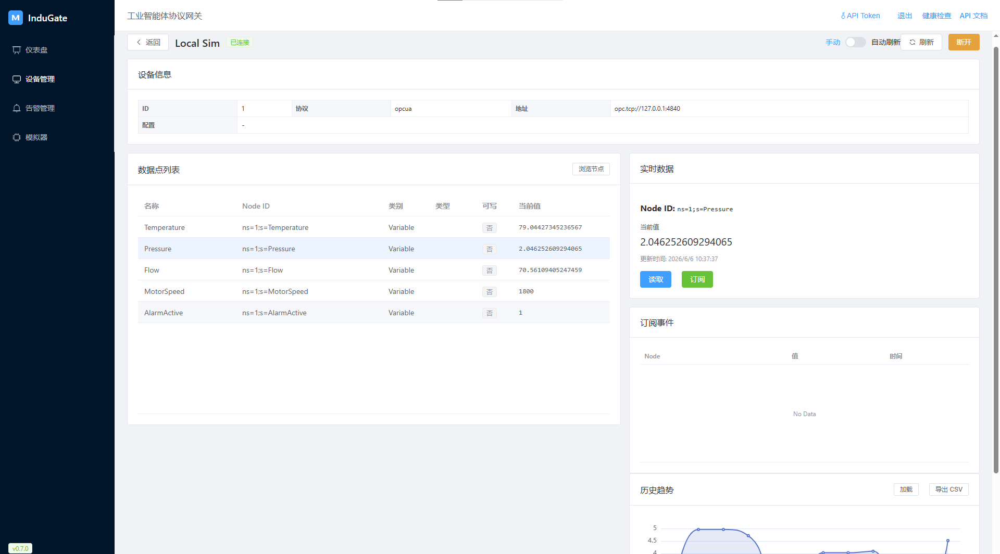
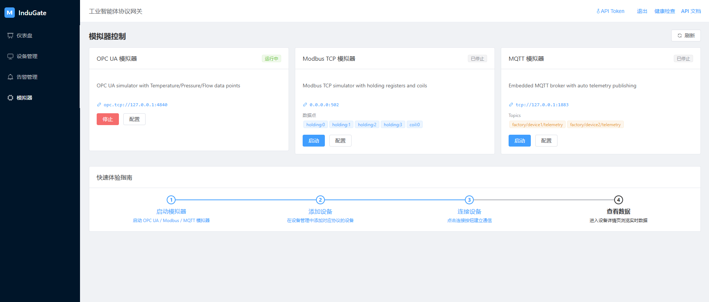

# InduGate - 工业智能体协议网关

> AI 智能体与工业设备之间的翻译官 — 让任何 Agent 都能通过标准 MCP 协议对接真实工业设备

[](https://gitee.com/zhbdream/indugate-gateway)
[](LICENSE)
[](docker-compose.yml)
[](go.mod)
[](web/)
[](CHANGELOG.md)

## 功能特性

- **多协议支持**：OPC UA、Modbus TCP、MQTT、Siemens S7、BACnet/IP
- **MCP 协议接入**：标准 Model Context Protocol，支持 HTTP + SSE，Agent 开箱即用
- **设备模拟器**：内置 OPC UA / Modbus / MQTT 模拟器，Docker 镜像自动启动，零硬件依赖
- **Web 管理面板**：仪表盘、设备、告警、用户权限、操作审计、模拟器控制
- **可选能力**：历史数据、InfluxDB、Prometheus 指标、JWT/RBAC、设备级 ACL、操作审计
- **一键部署**：`docker compose up` 启动 Gateway + Web UI + SQLite

## 界面预览

| 仪表盘 | 设备管理 |
|--------|----------|
|  |  |

| 设备实时数据 | 内置模拟器 |
|--------------|------------|
|  |  |

## 快速开始

```bash
git clone https://gitee.com/zhbdream/indugate-gateway.git
cd indugate-gateway
docker compose up -d --build
```

打开浏览器访问 **http://localhost:8080**

> 详细操作步骤、Windows 本地开发、常见问题见 **[快速开始文档](docs/quick-start.md)** · [架构说明](docs/architecture.md)

## 访问地址

| 服务 | 地址 |
|------|------|
| Web 管理面板 | http://localhost:8080 |
| REST API | http://localhost:8080/api/v1 |
| Swagger API 文档 | http://localhost:8080/swagger/index.html |
| 健康检查 | http://localhost:8080/health |
| Prometheus 指标 | http://localhost:8080/metrics（需 `metrics.enabled: true`） |
| MCP 服务发现 | http://localhost:8080/mcp/.well-known/mcp.json |
| MCP JSON-RPC | `POST /mcp/message` |
| MCP SSE | `GET/POST /mcp/sse` |

## Web 管理面板

基于 Vue 3 + Element Plus，路由与功能：

| 页面 | 路径 | 说明 |
|------|------|------|
| 仪表盘 | `/dashboard` | 设备/告警概览统计 |
| 设备管理 | `/devices` | 增删改查、连接/断开 |
| 设备详情 | `/devices/:id` | 浏览节点、读写、订阅 |
| 告警管理 | `/alerts` | 告警规则与事件确认 |
| 用户管理 | `/users` | 用户与设备权限（admin） |
| 操作审计 | `/audit` | 写操作审计日志（admin） |
| 模拟器 | `/simulators` | OPC UA / Modbus / MQTT 启停 |
| 登录 | `/login` | JWT 登录（`auth.enabled: true` 时） |

### 本地开发

> 完整步骤与排错见 **[docs/quick-start.md](docs/quick-start.md#方式二本地开发)**。

| 场景 | 怎么做 | 访问地址 |
|------|--------|----------|
| 最快体验 | `docker compose up -d --build` | :8080 |
| 改代码 | 终端1 `go run ./cmd/gateway` + 终端2 `cd web && npm run dev` | :3000 |
| 本地一体 | `cd web && npm run build` 后 `go run ./cmd/gateway` | :8080 |

**前置**：Go 1.24+、Node.js **18+**（Vite 6 不支持 Node 16）。Windows 无 `make`，直接用下方命令。

**Windows PowerShell：**

```powershell
# 国内 Go 依赖（可选）
$env:GOPROXY="https://goproxy.cn,direct"

# 终端 1：后端
if (-not (Test-Path data)) { mkdir data }
go run ./cmd/gateway
# 成功标志: gateway server starting {"addr": "0.0.0.0:8080"}

# 终端 2：前端（node -v 须 >= 18）
cd web ; npm install ; npm run dev
```

**说明：**

- 日志出现 `web static directory not found` 表示未构建前端，**:8080 无页面但 API 可用**；开发时用 **:3000** 或先 `npm run build`
- 8080 被占用时：`netstat -ano | findstr ":8080"` → `taskkill /PID <pid> /F`

**Linux / macOS：**

```bash
make deps && mkdir -p data && make run    # 终端 1
cd web && npm install && npm run dev      # 终端 2
```

## MCP 工具

| 工具 | 说明 |
|------|------|
| `list_devices` | 列出设备（可按协议/状态过滤） |
| `get_device_info` | 获取设备详情 |
| `read_data` | 读取数据点 |
| `write_data` | 写入数据点 |
| `subscribe_data` | 创建订阅（事件通过 REST 轮询） |

```bash
# 列出 MCP 工具
curl -X POST http://localhost:8080/mcp/message \
  -H "Content-Type: application/json" \
  -d '{"jsonrpc":"2.0","id":1,"method":"tools/list"}'

# Python 示例客户端
python examples/mcp-client/mcp_tools.py --list-tools
```

更多示例见 [examples/mcp-client/](examples/mcp-client/)。

## API 概览

```
# 认证
GET             /api/v1/auth/config
POST            /api/v1/auth/login
GET             /api/v1/auth/me

# 用户（admin）
GET/POST        /api/v1/users
PUT/DELETE      /api/v1/users/{id}
PUT             /api/v1/users/{id}/password
GET/PUT         /api/v1/users/{id}/devices

# 设备
GET/POST        /api/v1/devices
GET/PUT/DELETE  /api/v1/devices/{id}
POST            /api/v1/devices/{id}/connect
POST            /api/v1/devices/{id}/disconnect

# 数据与订阅
GET             /api/v1/devices/{id}/nodes
GET             /api/v1/devices/{id}/data/{nodeId}    # nodeId 需 URL 编码
GET             /api/v1/devices/{id}/data?node={id}   # nodeId 含 / 时用查询参数
POST            /api/v1/devices/{id}/data/{nodeId}
POST            /api/v1/devices/{id}/subscribe
GET             /api/v1/devices/{id}/subscriptions
GET             /api/v1/devices/{id}/subscriptions/{subId}/events
DELETE          /api/v1/devices/{id}/subscriptions/{subId}

# 历史数据
GET             /api/v1/devices/{id}/data/history
GET             /api/v1/devices/{id}/data/history/export

# 模拟器
GET             /api/v1/simulators
POST            /api/v1/simulators/{type}/start
POST            /api/v1/simulators/{type}/stop
PUT             /api/v1/simulators/{type}/config

# 告警
GET/POST        /api/v1/alerts/rules
PUT/DELETE      /api/v1/alerts/rules/{id}
GET             /api/v1/alerts/events
POST            /api/v1/alerts/events/{id}/acknowledge

# 仪表盘与审计
GET             /api/v1/dashboard/stats
GET             /api/v1/audit/logs
```

完整 OpenAPI 见 `/swagger/index.html`。

## 技术栈

| 组件 | 选型 |
|------|------|
| 后端 | Go 1.24+ / Gin / GORM / Zap / Viper |
| 前端 | Vue 3 / Vite / Element Plus / TypeScript |
| 数据库 | SQLite（默认）/ PostgreSQL（生产） |
| 时序（可选） | InfluxDB |
| 部署 | Docker / Docker Compose |

## 项目结构

```
indugate-gateway/
├── cmd/gateway/           # 应用入口
├── internal/
│   ├── api/               # HTTP 路由、Handler、中间件
│   ├── mcp/               # MCP Server（Tools / SSE）
│   ├── protocol/          # 协议驱动（opcua/modbus/mqtt/s7/bacnet）
│   ├── simulator/         # 内置模拟器
│   ├── service/           # 业务服务
│   ├── model/             # 数据模型
│   ├── config/            # 配置加载
│   ├── storage/           # 数据库
│   └── metrics/           # Prometheus
├── web/                   # Vue 3 前端
├── configs/               # 配置文件
├── examples/              # MCP / REST 集成示例
├── deployments/           # Docker、Grafana 等
├── docker-compose.yml     # 一键启动（推荐）
└── docs/                  # 文档
```

## Docker 部署

### 一键启动（推荐）

```bash
docker compose up -d --build    # 启动
docker compose logs -f          # 日志
docker compose down             # 停止
```

包含：Gateway + Web UI + SQLite；镜像通过环境变量**自动启动** OPC UA / Modbus / MQTT 模拟器。

### 完整栈（PostgreSQL + InfluxDB + Mosquitto）

```bash
docker compose -f deployments/docker/docker-compose.yml up -d --build
```

## 配置

主配置文件：`configs/config.yaml`，环境变量前缀 `INDUGATE_`：

```bash
export INDUGATE_SERVER_PORT=9090
export INDUGATE_DATABASE_DRIVER=sqlite
export INDUGATE_SIMULATOR_MODBUS_AUTO_START=true
export INDUGATE_INFLUXDB_ENABLED=true
```

### 告警通知

```yaml
alerts:
  webhook_url: "https://hooks.example.com/alerts"
  mqtt_enabled: true
  mqtt_broker: "tcp://localhost:1883"
  mqtt_topic: "indugate/alerts"
```

### 历史数据

```yaml
history:
  retention_days: 30
  cleanup_interval_hours: 24
```

### InfluxDB（可选）

```yaml
influxdb:
  enabled: true
  url: "http://localhost:8086"
  org: "indugate"
  bucket: "telemetry"
```

### API 认证（可选，默认关闭）

```yaml
auth:
  enabled: true
  api_token: "your-secret-token"   # 静态 Bearer Token
  jwt_secret: "change-me-in-production"
  default_admin_user: "admin"
  default_admin_password: "admin123"
```

- `POST /api/v1/auth/login` — JWT 登录
- 请求头：`Authorization: Bearer <token>`

Web 面板右上角 **API Token** 可配置静态 Token；启用 JWT 后使用 `/login` 页面。

### RBAC 角色

| 角色 | 权限 |
|------|------|
| admin | 全部 API + 用户管理 |
| operator | 设备/数据/告警/模拟器读写 |
| viewer | REST 只读 GET；MCP 仅只读工具（`list_devices` / `read_data` 等） |

### 设备级权限

```yaml
auth:
  device_acl_enabled: true
```

非 admin 用户仅能访问被分配的设备（`PUT /api/v1/users/:id/devices`）。

BACnet 设备可启用 COV 订阅：

```json
{"device_id": 1234, "cov_enabled": true, "cov_lifetime_sec": 300}
```

### Prometheus

```yaml
metrics:
  enabled: true
```

`GET /metrics` 提供 `indugate_devices_total`、`indugate_active_alerts` 等指标。Grafana 模板见 `deployments/grafana/`。

### 操作审计

```yaml
audit:
  enabled: true
  retention_days: 90
```

启用 `auth.enabled` 后记录写操作；`GET /api/v1/audit/logs`（admin）或 Web `/audit`。

## 开发命令

**Linux / macOS（需安装 make）：**

```bash
make help        # 查看所有命令
make build       # 编译后端
make run         # 本地运行
make test        # 运行测试
make docker-up   # Docker 完整栈
```

**Windows：** 无 make，见上方「本地开发」或 [docs/quick-start.md](docs/quick-start.md)。

```powershell
go test ./...                        # 运行测试
.\scripts\dev.ps1 backend            # 启动后端
.\scripts\dev.ps1 frontend           # 启动前端
docker compose up -d --build         # Docker 一键启动
```

## 文档与示例

| 资源 | 说明 |
|------|------|
| [docs/quick-start.md](docs/quick-start.md) | **快速开始、本地开发、常见问题** |
| [docs/architecture.md](docs/architecture.md) | 架构与目录 |
| [docs/opcua-test-guide.md](docs/opcua-test-guide.md) | OPC UA 测试 |
| [examples/mcp-client/](examples/mcp-client/) | MCP Python 客户端 |
| [CONTRIBUTING.md](CONTRIBUTING.md) | 贡献指南 |
| [CHANGELOG.md](CHANGELOG.md) | 版本记录 |

## License

MIT
